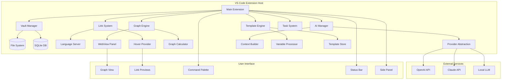

# Technical Architecture - Obsidian Features in VS Code

## 🏛️ System Architecture Overview



## 📦 Core Components

### 1. Vault Manager Component

```typescript
// src/vault/VaultManager.ts
import * as vscode from 'vscode';
import * as path from 'path';
import { FileSystemWatcher } from './FileSystemWatcher';
import { MetadataIndex } from './MetadataIndex';

export class VaultManager {
    private static instance: VaultManager;
    private vaultPath: string;
    private watcher: FileSystemWatcher;
    private index: MetadataIndex;
    private db: Database;
    
    private constructor(context: vscode.ExtensionContext) {
        this.vaultPath = path.join(
            vscode.workspace.rootPath!, 
            '.assistant-vault'
        );
        this.initializeVault();
        this.setupWatchers();
        this.buildIndex();
    }
    
    static getInstance(context: vscode.ExtensionContext): VaultManager {
        if (!VaultManager.instance) {
            VaultManager.instance = new VaultManager(context);
        }
        return VaultManager.instance;
    }
    
    private async initializeVault() {
        const folders = [
            'knowledge/concepts',
            'knowledge/projects',
            'knowledge/references',
            'conversations',
            'templates',
            'daily',
            'tasks',
            '.meta'
        ];
        
        for (const folder of folders) {
            await vscode.workspace.fs.createDirectory(
                vscode.Uri.file(path.join(this.vaultPath, folder))
            );
        }
    }
    
    async createNote(
        title: string, 
        content: string, 
        metadata?: NoteFrontmatter
    ): Promise<string> {
        const fileName = this.sanitizeFileName(title);
        const filePath = path.join(this.vaultPath, 'knowledge', `${fileName}.md`);
        
        const frontmatter = this.generateFrontmatter(metadata);
        const fullContent = `${frontmatter}\n\n# ${title}\n\n${content}`;
        
        await vscode.workspace.fs.writeFile(
            vscode.Uri.file(filePath),
            Buffer.from(fullContent)
        );
        
        this.index.addNote(filePath, metadata);
        return filePath;
    }
    
    async searchNotes(query: string): Promise<SearchResult[]> {
        return this.index.search(query);
    }
}
```

### 2. Bidirectional Linking System

```typescript
// src/linking/LinkProvider.ts
import * as vscode from 'vscode';
import { VaultManager } from '../vault/VaultManager';

export class LinkProvider implements 
    vscode.HoverProvider,
    vscode.CompletionItemProvider,
    vscode.DefinitionProvider {
    
    private linkPattern = /\[\[([^\]]+)\]\]/g;
    private backlinks: Map<string, Set<string>> = new Map();
    
    constructor(private vault: VaultManager) {
        this.buildBacklinkIndex();
    }
    
    provideHover(
        document: vscode.TextDocument,
        position: vscode.Position
    ): vscode.ProviderResult<vscode.Hover> {
        const range = document.getWordRangeAtPosition(position, this.linkPattern);
        if (!range) return;
        
        const linkText = document.getText(range);
        const noteName = linkText.slice(2, -2);
        const linkedNote = this.vault.findNote(noteName);
        
        if (linkedNote) {
            const preview = this.generatePreview(linkedNote);
            const backlinksCount = this.backlinks.get(linkedNote.path)?.size || 0;
            
            const markdown = new vscode.MarkdownString();
            markdown.appendMarkdown(`**${linkedNote.title}**\n\n`);
            markdown.appendMarkdown(preview);
            markdown.appendMarkdown(`\n\n---\n`);
            markdown.appendMarkdown(`*${backlinksCount} backlinks*`);
            
            return new vscode.Hover(markdown, range);
        }
    }
    
    provideCompletionItems(
        document: vscode.TextDocument,
        position: vscode.Position
    ): vscode.ProviderResult<vscode.CompletionItem[]> {
        const linePrefix = document.lineAt(position).text.substr(0, position.character);
        
        if (!linePrefix.includes('[[')) {
            return undefined;
        }
        
        const notes = this.vault.getAllNotes();
        return notes.map(note => {
            const item = new vscode.CompletionItem(
                note.title,
                vscode.CompletionItemKind.Reference
            );
            item.insertText = `[[${note.title}]]`;
            item.detail = note.path;
            item.documentation = new vscode.MarkdownString(
                this.generatePreview(note)
            );
            return item;
        });
    }
    
    provideDefinition(
        document: vscode.TextDocument,
        position: vscode.Position
    ): vscode.ProviderResult<vscode.Definition> {
        const range = document.getWordRangeAtPosition(position, this.linkPattern);
        if (!range) return;
        
        const linkText = document.getText(range);
        const noteName = linkText.slice(2, -2);
        const linkedNote = this.vault.findNote(noteName);
        
        if (linkedNote) {
            return new vscode.Location(
                vscode.Uri.file(linkedNote.path),
                new vscode.Position(0, 0)
            );
        }
    }
    
    private buildBacklinkIndex() {
        const notes = this.vault.getAllNotes();
        
        for (const note of notes) {
            const content = note.content;
            const matches = content.matchAll(this.linkPattern);
            
            for (const match of matches) {
                const linkedNoteName = match[1];
                const linkedNote = this.vault.findNote(linkedNoteName);
                
                if (linkedNote) {
                    if (!this.backlinks.has(linkedNote.path)) {
                        this.backlinks.set(linkedNote.path, new Set());
                    }
                    this.backlinks.get(linkedNote.path)!.add(note.path);
                }
            }
        }
    }
}
```

### 3. Knowledge Graph Engine

```typescript
// src/graph/GraphEngine.ts
import * as vscode from 'vscode';
import { VaultManager } from '../vault/VaultManager';

interface GraphNode {
    id: string;
    label: string;
    type: 'note' | 'tag' | 'folder';
    x?: number;
    y?: number;
    size: number;
    color: string;
}

interface GraphEdge {
    source: string;
    target: string;
    weight: number;
    type: 'link' | 'tag' | 'folder';
}

export class GraphEngine {
    private nodes: Map<string, GraphNode> = new Map();
    private edges: GraphEdge[] = [];
    private panel: vscode.WebviewPanel | undefined;
    
    constructor(private vault: VaultManager) {}
    
    async showGraph(context: vscode.ExtensionContext) {
        this.panel = vscode.window.createWebviewPanel(
            'knowledgeGraph',
            'Knowledge Graph',
            vscode.ViewColumn.One,
            {
                enableScripts: true,
                retainContextWhenHidden: true
            }
        );
        
        await this.buildGraph();
        this.panel.webview.html = this.getWebviewContent();
        
        // Handle messages from webview
        this.panel.webview.onDidReceiveMessage(
            message => this.handleWebviewMessage(message),
            undefined,
            context.subscriptions
        );
    }
    
    private async buildGraph() {
        const notes = this.vault.getAllNotes();
        
        // Create nodes for notes
        for (const note of notes) {
            this.nodes.set(note.id, {
                id: note.id,
                label: note.title,
                type: 'note',
                size: this.calculateNodeSize(note),
                color: this.getNodeColor(note)
            });
        }
        
        // Create edges for links
        for (const note of notes) {
            const links = this.extractLinks(note.content);
            for (const link of links) {
                const target = this.vault.findNote(link);
                if (target) {
                    this.edges.push({
                        source: note.id,
                        target: target.id,
                        weight: 1,
                        type: 'link'
                    });
                }
            }
        }
        
        // Apply force-directed layout
        this.applyForceLayout();
    }
    
    private applyForceLayout() {
        // Implement force-directed graph layout algorithm
        // Using d3-force or custom physics simulation
        const simulation = {
            nodes: Array.from(this.nodes.values()),
            edges: this.edges,
            
            tick: () => {
                // Update node positions based on forces
                // - Attractive force between linked nodes
                // - Repulsive force between all nodes
                // - Centering force to keep graph centered
            }
        };
        
        // Run simulation for N iterations
        for (let i = 0; i < 100; i++) {
            simulation.tick();
        }
    }
    
    private getWebviewContent(): string {
        return `<!DOCTYPE html>
        <html lang="en">
        <head>
            <meta charset="UTF-8">
            <meta name="viewport" content="width=device-width, initial-scale=1.0">
            <title>Knowledge Graph</title>
            <script src="https://d3js.org/d3.v7.min.js"></script>
            <style>
                body { margin: 0; padding: 0; overflow: hidden; }
                #graph { width: 100vw; height: 100vh; }
                .node { cursor: pointer; }
                .node:hover { stroke: #000; stroke-width: 2px; }
                .link { stroke: #999; stroke-opacity: 0.6; }
                .node-label { font-size: 12px; pointer-events: none; }
                
                .controls {
                    position: absolute;
                    top: 10px;
                    right: 10px;
                    background: rgba(255, 255, 255, 0.9);
                    padding: 10px;
                    border-radius: 8px;
                }
            </style>
        </head>
        <body>
            <div id="graph"></div>
            <div class="controls">
                <button onclick="zoomIn()">Zoom In</button>
                <button onclick="zoomOut()">Zoom Out</button>
                <button onclick="resetView()">Reset</button>
                <select id="filter" onchange="applyFilter()">
                    <option value="all">All Notes</option>
                    <option value="recent">Recent</option>
                    <option value="tagged">Tagged</option>
                </select>
            </div>
            <script>
                const vscode = acquireVsCodeApi();
                const graphData = ${JSON.stringify({
                    nodes: Array.from(this.nodes.values()),
                    links: this.edges
                })};
                
                // D3.js graph rendering
                const width = window.innerWidth;
                const height = window.innerHeight;
                
                const svg = d3.select("#graph")
                    .append("svg")
                    .attr("width", width)
                    .attr("height", height);
                
                const simulation = d3.forceSimulation(graphData.nodes)
                    .force("link", d3.forceLink(graphData.links).id(d => d.id))
                    .force("charge", d3.forceManyBody().strength(-300))
                    .force("center", d3.forceCenter(width / 2, height / 2));
                
                // Render links
                const link = svg.append("g")
                    .selectAll("line")
                    .data(graphData.links)
                    .enter().append("line")
                    .attr("class", "link");
                
                // Render nodes
                const node = svg.append("g")
                    .selectAll("circle")
                    .data(graphData.nodes)
                    .enter().append("circle")
                    .attr("class", "node")
                    .attr("r", d => d.size)
                    .attr("fill", d => d.color)
                    .call(d3.drag()
                        .on("start", dragstarted)
                        .on("drag", dragged)
                        .on("end", dragended))
                    .on("click", (event, d) => {
                        vscode.postMessage({
                            command: 'openNote',
                            noteId: d.id
                        });
                    });
                
                // Add labels
                const label = svg.append("g")
                    .selectAll("text")
                    .data(graphData.nodes)
                    .enter().append("text")
                    .attr("class", "node-label")
                    .text(d => d.label);
                
                simulation.on("tick", () => {
                    link
                        .attr("x1", d => d.source.x)
                        .attr("y1", d => d.source.y)
                        .attr("x2", d => d.target.x)
                        .attr("y2", d => d.target.y);
                    
                    node
                        .attr("cx", d => d.x)
                        .attr("cy", d => d.y);
                    
                    label
                        .attr("x", d => d.x)
                        .attr("y", d => d.y);
                });
                
                // Drag functions
                function dragstarted(event, d) {
                    if (!event.active) simulation.alphaTarget(0.3).restart();
                    d.fx = d.x;
                    d.fy = d.y;
                }
                
                function dragged(event, d) {
                    d.fx = event.x;
                    d.fy = event.y;
                }
                
                function dragended(event, d) {
                    if (!event.active) simulation.alphaTarget(0);
                    d.fx = null;
                    d.fy = null;
                }
                
                // Zoom functions
                const zoom = d3.zoom()
                    .scaleExtent([0.1, 10])
                    .on("zoom", (event) => {
                        svg.selectAll("g").attr("transform", event.transform);
                    });
                
                svg.call(zoom);
                
                function zoomIn() {
                    svg.transition().call(zoom.scaleBy, 1.3);
                }
                
                function zoomOut() {
                    svg.transition().call(zoom.scaleBy, 0.7);
                }
                
                function resetView() {
                    svg.transition().call(zoom.transform, d3.zoomIdentity);
                }
            </script>
        </body>
        </html>`;
    }
}
```

### 4. AI Integration Layer

```typescript
// src/ai/AIManager.ts
import * as vscode from 'vscode';
import { Configuration, OpenAIApi } from 'openai';
import Anthropic from '@anthropic-ai/sdk';

export interface AIContext {
    recentNotes: string[];
    currentFile: string;
    selectedText: string;
    vaultStatistics: {
        totalNotes: number;
        totalTags: number;
        recentActivity: string[];
    };
}

export class AIManager {
    private openai: OpenAIApi;
    private anthropic: Anthropic;
    private currentProvider: 'openai' | 'anthropic' | 'local';
    
    constructor(private vault: VaultManager) {
        this.initializeProviders();
    }
    
    private initializeProviders() {
        // OpenAI
        const openaiConfig = new Configuration({
            apiKey: vscode.workspace.getConfiguration('assistant').get('openaiKey')
        });
        this.openai = new OpenAIApi(openaiConfig);
        
        // Anthropic
        this.anthropic = new Anthropic({
            apiKey: vscode.workspace.getConfiguration('assistant').get('anthropicKey')
        });
    }
    
    async generateNote(
        topic: string,
        template?: string
    ): Promise<string> {
        const context = await this.buildContext();
        
        const prompt = `
        Generate a comprehensive note about: ${topic}
        
        Context from vault:
        - Total notes: ${context.vaultStatistics.totalNotes}
        - Recent notes: ${context.recentNotes.join(', ')}
        
        ${template ? `Use this template structure: ${template}` : ''}
        
        Format the output as a markdown note with:
        - YAML frontmatter (title, tags, date)
        - Clear sections and headings
        - Links to related notes using [[Note Name]] syntax
        `;
        
        switch (this.currentProvider) {
            case 'openai':
                return this.generateWithOpenAI(prompt);
            case 'anthropic':
                return this.generateWithAnthropic(prompt);
            case 'local':
                return this.generateWithLocalLLM(prompt);
        }
    }
    
    async suggestLinks(content: string): Promise<string[]> {
        // Generate embedding for current content
        const embedding = await this.generateEmbedding(content);
        
        // Find similar notes using cosine similarity
        const similarNotes = await this.findSimilarNotes(embedding);
        
        // Use AI to rank and filter suggestions
        const prompt = `
        Given this content: ${content.substring(0, 500)}
        
        And these potentially related notes:
        ${similarNotes.map(n => `- ${n.title}: ${n.summary}`).join('\n')}
        
        Suggest the 5 most relevant notes to link, explaining why each is relevant.
        `;
        
        const suggestions = await this.complete(prompt);
        return this.parseLinkSuggestions(suggestions);
    }
    
    async autoTag(content: string): Promise<string[]> {
        const existingTags = this.vault.getAllTags();
        
        const prompt = `
        Analyze this content and suggest relevant tags:
        ${content.substring(0, 1000)}
        
        Existing tags in vault: ${existingTags.join(', ')}
        
        Suggest 3-5 tags that best categorize this content.
        Prefer existing tags when appropriate, but suggest new ones if needed.
        Format: Return only a comma-separated list of tags.
        `;
        
        const response = await this.complete(prompt);
        return response.split(',').map(tag => tag.trim());
    }
    
    async smartSearch(
        query: string,
        options: SearchOptions
    ): Promise<SearchResult[]> {
        // Enhance query with AI
        const enhancedQuery = await this.enhanceSearchQuery(query);
        
        // Perform semantic search
        const embedding = await this.generateEmbedding(enhancedQuery);
        const semanticResults = await this.semanticSearch(embedding);
        
        // Combine with keyword search
        const keywordResults = await this.vault.searchNotes(query);
        
        // Use AI to rank and merge results
        return this.rankSearchResults(semanticResults, keywordResults, query);
    }
    
    private async generateEmbedding(text: string): Promise<number[]> {
        if (this.currentProvider === 'openai') {
            const response = await this.openai.createEmbedding({
                model: 'text-embedding-ada-002',
                input: text
            });
            return response.data.data[0].embedding;
        }
        // Implement for other providers
        return [];
    }
}
```

### 5. Template Engine

```typescript
// src/templates/TemplateEngine.ts
import * as vscode from 'vscode';
import { AIManager } from '../ai/AIManager';

export class TemplateEngine {
    private templates: Map<string, Template> = new Map();
    private variables: Map<string, () => Promise<string>>;
    
    constructor(
        private vault: VaultManager,
        private ai: AIManager
    ) {
        this.registerBuiltInVariables();
        this.loadTemplates();
    }
    
    private registerBuiltInVariables() {
        this.variables = new Map([
            ['date', async () => new Date().toISOString().split('T')[0]],
            ['time', async () => new Date().toLocaleTimeString()],
            ['user', async () => vscode.env.machineId],
            ['workspace', async () => vscode.workspace.name || ''],
            ['selection', async () => {
                const editor = vscode.window.activeTextEditor;
                return editor ? editor.document.getText(editor.selection) : '';
            }],
            ['clipboard', async () => vscode.env.clipboard.readText()],
            ['recent_notes', async () => {
                const recent = await this.vault.getRecentNotes(5);
                return recent.map(n => `- [[${n.title}]]`).join('\n');
            }],
            ['ai', async (prompt: string) => {
                return this.ai.complete(prompt);
            }]
        ]);
    }
    
    async applyTemplate(
        templateName: string,
        customVariables?: Record<string, string>
    ): Promise<string> {
        const template = this.templates.get(templateName);
        if (!template) {
            throw new Error(`Template ${templateName} not found`);
        }
        
        let content = template.content;
        
        // Process variables
        const variablePattern = /\{\{(\w+)(?::([^}]+))?\}\}/g;
        const matches = Array.from(content.matchAll(variablePattern));
        
        for (const match of matches) {
            const [fullMatch, varName, varArgs] = match;
            
            let value: string;
            if (customVariables && varName in customVariables) {
                value = customVariables[varName];
            } else if (this.variables.has(varName)) {
                const varFunc = this.variables.get(varName)!;
                value = await varFunc(varArgs);
            } else {
                value = fullMatch; // Keep original if not found
            }
            
            content = content.replace(fullMatch, value);
        }
        
        return content;
    }
    
    registerTemplate(name: string, content: string) {
        this.templates.set(name, {
            name,
            content,
            created: new Date(),
            category: 'custom'
        });
    }
    
    private loadTemplates() {
        // Load built-in templates
        this.registerTemplate('daily', `---
title: Daily Note {{date}}
date: {{date}}
tags: [daily, journal]
---

# {{date}} - Daily Note

## Morning Intentions
{{ai:What should I focus on today based on my recent work?}}

## Tasks
- [ ] 

## Notes


## Evening Reflection
- What went well today?
- What could be improved?
- What am I grateful for?

## Links
{{recent_notes}}
`);

        this.registerTemplate('meeting', `---
title: Meeting - {{title}}
date: {{date}}
time: {{time}}
attendees: {{attendees}}
tags: [meeting]
---

# Meeting: {{title}}

## Attendees
{{attendees}}

## Agenda
{{agenda}}

## Discussion Notes


## Action Items
- [ ] 

## Decisions Made


## Next Steps


## Related Notes
{{recent_notes}}
`);

        this.registerTemplate('project', `---
title: {{project_name}}
type: project
status: planning
tags: [project]
created: {{date}}
---

# Project: {{project_name}}

## Overview
{{ai:Generate a project overview template}}

## Goals
- 

## Stakeholders
- 

## Timeline
- **Start Date**: {{date}}
- **Target Completion**: 
- **Milestones**:
  - 

## Technical Requirements


## Resources Needed


## Risks & Mitigation


## Related Notes
- 
`);
    }
}
```

## 🔌 Extension Manifest

```json
{
    "name": "vscode-personal-assistant",
    "displayName": "Personal Assistant with Obsidian Features",
    "version": "1.0.0",
    "engines": {
        "vscode": "^1.74.0"
    },
    "categories": ["Other", "AI", "Notebooks"],
    "activationEvents": [
        "onStartupFinished",
        "onCommand:assistant.createNote",
        "onCommand:assistant.showGraph"
    ],
    "main": "./out/extension.js",
    "contributes": {
        "commands": [
            {
                "command": "assistant.createNote",
                "title": "Create New Note",
                "icon": "$(new-file)"
            },
            {
                "command": "assistant.showGraph",
                "title": "Show Knowledge Graph",
                "icon": "$(graph)"
            },
            {
                "command": "assistant.searchVault",
                "title": "Search Vault",
                "icon": "$(search)"
            }
        ],
        "configuration": {
            "title": "Personal Assistant",
            "properties": {
                "assistant.vaultPath": {
                    "type": "string",
                    "default": ".assistant-vault",
                    "description": "Path to vault folder"
                },
                "assistant.aiProvider": {
                    "type": "string",
                    "enum": ["openai", "anthropic", "local"],
                    "default": "openai",
                    "description": "AI provider to use"
                }
            }
        },
        "languages": [
            {
                "id": "markdown",
                "extensions": [".md"],
                "aliases": ["Markdown", "markdown"]
            }
        ],
        "grammars": [
            {
                "language": "markdown",
                "scopeName": "text.html.markdown.assistant",
                "path": "./syntaxes/markdown-extended.tmLanguage.json"
            }
        ],
        "viewsContainers": {
            "activitybar": [
                {
                    "id": "assistant",
                    "title": "Personal Assistant",
                    "icon": "$(notebook)"
                }
            ]
        },
        "views": {
            "assistant": [
                {
                    "id": "assistant.vault",
                    "name": "Vault Explorer",
                    "icon": "$(folder-library)"
                },
                {
                    "id": "assistant.backlinks",
                    "name": "Backlinks",
                    "icon": "$(references)"
                },
                {
                    "id": "assistant.tags",
                    "name": "Tags",
                    "icon": "$(tag)"
                },
                {
                    "id": "assistant.tasks",
                    "name": "Tasks",
                    "icon": "$(checklist)"
                }
            ]
        }
    }
}
```

## 🚀 Implementation Roadmap

### Week 1-2: Foundation
- ✅ Archive old mockups
- [ ] Set up extension boilerplate
- [ ] Implement vault structure
- [ ] Basic file operations

### Week 3-4: Linking
- [ ] Wiki-link syntax highlighting
- [ ] Link completion provider
- [ ] Backlinks tracking
- [ ] Hover previews

### Week 5-6: Graph & Search
- [ ] Graph data structure
- [ ] WebView graph visualization
- [ ] Semantic search with embeddings
- [ ] Tag system

### Week 7-8: AI Integration
- [ ] Provider abstraction
- [ ] Smart templates
- [ ] Auto-tagging
- [ ] Context-aware suggestions

### Week 9-10: Polish
- [ ] Performance optimization
- [ ] UI refinement
- [ ] Documentation
- [ ] Testing

This architecture provides a solid foundation for integrating Obsidian's best features into VS Code while leveraging the IDE's unique capabilities.